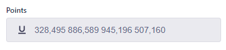
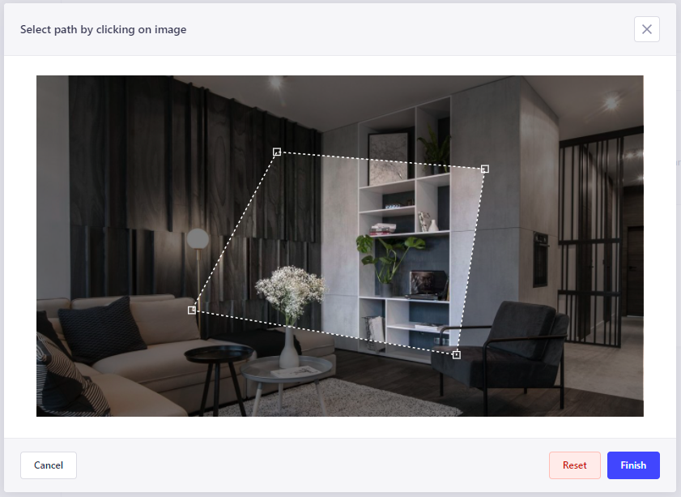

# Strapi plugin point-list

A plugin for [Strapi CMS](https://github.com/strapi/strapi) that provides point list field.





## Table of Contents

- [Strapi@v4 Installation](#strapi-v4-installation)
- [Strapi@v3 Installation](#strapi-v3-installation)

## Strapi v4 installation

```bash
npm install strapi-plugin-point-list
```

Enable plugin in `config/plugins.js`:

```diff
module.exports = {
+  'strapi-plugin-point-list': {
+    enabled: true,
+    resolve: 'node_modules/strapi-plugin-point-list'
+  },
}
```

Field by default is not going to appear in the UI. You need to enable it manually. To enable the component in any content type you've to add the attribute in a configuration model json file (*.settings.json) at `src/api/example/content-type/schema.json`:

```diff
{
  "attributes": {
    "path": {
-      "type": "string"
+      "type": "string",
+      "fieldRenderer": "pointlist"
    }
  }
}
```

After successful installation you need to rebuild the strapi admin panel.

```bash
npm run build && npm run develop
```

## Strapi v3 installation

```bash
npm install strapi-plugin-point-list@3.0.0
```

Component by default is not going to appear in the UI. You need to enable it manually. To enable the component in any content type you've to add the attribute in a configuration model json file (*.settings.json) at `api/example/models/example.settings.json`:

```diff
{
  "attributes": {
    "path": {
-      "type": "string",
+      "type": "pointlist",
+      "columnType": "text"
    }
  }
}
```

> Consider setting the "columnType" parameter to "longtext" or some other data type supported by your database.

After successful installation you need to rebuild the strapi admin panel.

```bash
npm run build && npm run develop
```

## Contributing / Developing

Feel free to post any PR or issues.
